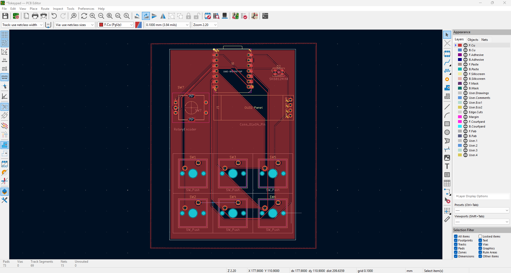

# Important Note
My PCB design has a slight error as the 5V on MC is connected to the VCC of OLED. I fixed this by physically cutting the trace and checking if the connection is severed using a multimeter. Then I soldered a wire at the back of the PCB going from VCC of OLED to 3.3V on MC. This fixed the error. Also I got lazy and didn't use an LED. It wasn't going to be of much use anyways. 

# Description
IBM Model M keyboard themed macropad with a rotary encoder for volume control, 6 keys and a 0.91 inch OLED display. 

# Challenges
It was my first ever electronics project. First time using KiCad, Fusion and QMK. I spent many hours just trying to figure out how to do something by Googling and watching tutorials on YouTube. I had to redesign my schematics, PCB and 3D model numerous times. 3D modeling was much harder than I anticipated at first. Even though I made many errors, I believe this shows my learning progress because you can't learn without making mistakes. 

# Specs/BOM

- 1x XIAO RP2040
- 1x SK6812 MINI Led
- 4x M3x16 Bolt
- 4x M3 Heatset
- 6x Cherry MX Switches
- 6x Blank DSA Keycaps
- 1x I2C OLED Display Module 0.91 Inch SSD1306
- 1x Rotary Encoder Module

| Schematic | PCB Design | 3D Model |
| :---: | :---: | :---: |
|  |  |  |
| *Circuit Diagram* | *Top/Bottom Layers* | *Fusion 360 Render* |

